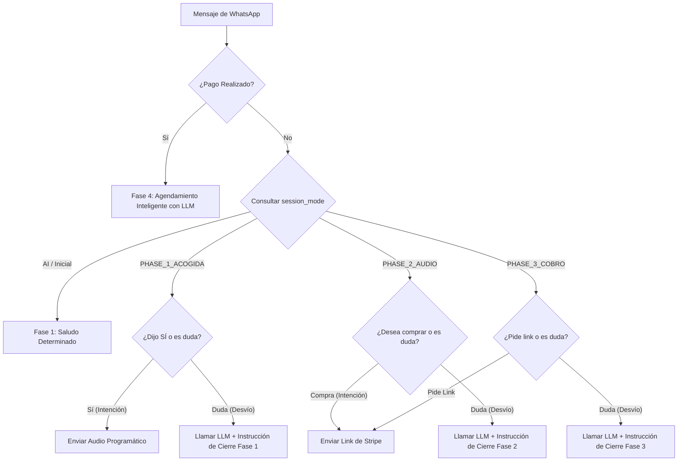

# Reporte de Arquitectura: Enrutamiento Determinista de Estados (Conversational Switch)

A raíz de los análisis de estabilidad realizados bajo la migración a OpenRouter, se ha rediseñado el motor conversacional de Orus para transicionar de un modelo 100% dependiente de decisiones de la IA (Tool Calling en cada turno) a una **arquitectura híbrida estructurada (Máquina de Estados + LLM)**. 

Con esta implementación, eliminamos por completo la posibilidad de que el LLM omita el envío del audio explicativo o del enlace de pago, garantizando un flujo comercial 100% determinista y estable.

---

## 1. El Conflicto de las Herramientas en LLMs Comerciales
Fiar en que un LLM decida autónomamente cuándo usar una herramienta (`send_introductory_audio`, `generate_payment_link`) para transiciones lineales simples es inestable:
1. **Omisión de Herramienta:** El modelo a veces genera el token de éxito (`[AUDIO_ENVIADO]` o `[COBRO_ENVIADO]`) en texto pero no emite la llamada de función estructurada (Tool Call), dejando al cliente en un limbo.
2. **Degradación por Costo/API:** Al cambiar de proveedor (OpenRouter con modelos de bajo costo), las llamadas a funciones nativas pueden variar en comportamiento de un modelo a otro.

---

## 2. La Nueva Arquitectura: Switch Conversacional Determinista
Hemos implementado un enrutador en `api/services/message_processor.py` que intercepta los mensajes según el estado guardado del usuario en la base de datos (`session_mode`) y el contenido de su mensaje.

### Diagrama del Flujo Conversacional

---

## 3. Implementación Técnica Detallada

### 3.1. Fase 1: Bienvenida Determinista
Cuando un usuario inicia contacto por primera vez (`session_mode` es `'AI'`), el sistema no consulta al LLM. Le envía de inmediato el saludo clínico estandarizado de El Escultor y lo mueve a `'PHASE_1_ACOGIDA'`. Esto ahorra tokens y asegura un primer impacto idéntico para todos los leads.

### 3.2. Fase 2: Envío de Audio Explicativo
Si el usuario está en `'PHASE_1_ACOGIDA'` y responde afirmativamente (por ejemplo, "sí", "si", "quiero", "explicame"):
* Se ejecuta **programáticamente** `send_introductory_audio`.
* Se actualiza su estado a `'PHASE_2_AUDIO'`.
* El LLM no interviene en absoluto en la decisión.

### 3.3. Fase 3: Envío del Enlace de Pago
Si el usuario está en `'PHASE_2_AUDIO'` y demuestra intención de compra (por ejemplo, "cómo pago", "link", "quiero comprar", "quiero iniciar"):
* Se ejecuta **programáticamente** `generate_payment_link`.
* Se actualiza su estado a `'PHASE_3_COBRO'`.
* De nuevo, el LLM no tiene la oportunidad de fallar o ignorar la llamada.

### 3.4. Gestión de Desvíos (Preguntas u Objeciones)
Si el usuario realiza una pregunta o desvío en cualquier etapa (contiene signos de interrogación o términos como "precio", "dónde están", "¿quién es Orus?"), el switch **enruta el mensaje al LLM**. 
Sin embargo, inyectamos una **instrucción interna obligatoria** al final de su mensaje según su fase activa:
* **Fase 1 desvío:** *"Responde clínicamente, luego invítalo directamente a escuchar el audio explicativo de 3 minutos de la Auditoría Biosemiótica respondiendo SÍ."*
* **Fase 2 desvío:** *"Responde clínicamente, luego pregúntale directamente si desea iniciar su proceso para enviarle el enlace seguro de pago (49 USD)."*
* **Fase 3 desvío:** *"Responde clínicamente y guíalo a realizar el pago mediante el enlace seguro que le enviaste para poder habilitar la agenda."*

### 3.5. Red de Seguridad en `gemini_client.py` (Double-Check)
Como capa final de blindaje ante cualquier desvío que procese el LLM, el cliente de OpenRouter tiene una comprobación final: si el texto devuelto por el LLM incluye los tokens de éxito `[AUDIO_ENVIADO]` o `[COBRO_ENVIADO]` pero se detecta que no se ejecutaron las herramientas correspondientes, el backend intercepta el flujo y **despacha la acción de manera programática** de inmediato.

---

## 4. Fase 4: Agendamiento Inteligente (Bajo Control del LLM)
Una vez que el usuario paga, el webhook de Stripe updates su estado a `'paid'`, lo que **desactiva el switch determinista**. A partir de este momento, el control se entrega al LLM con las herramientas `check_free_slots` y `book_appointment` habilitadas.

El LLM destaca en esta fase porque el agendamiento requiere interpretar lenguaje natural complejo (por ejemplo, *"puedo el próximo jueves a la mañana"*). El prompt actual de Orus cuenta con reglas estrictas de anclaje de fechas y confirmación secuencial de datos para evitar que el bot reserve sin nombre o correo.

---

## 5. Cambios Realizados en el Repositorio
1. **`api/services/message_processor.py`**:
   * Implementación de la máquina de estados determinista (Fases 1, 2 y 3) basada en `session_mode` y `payment_status`.
   * Enrutamiento inteligente de desvíos mediante la inyección contextual de instrucciones del sistema en el prompt del usuario.
   * Pasado de la variable `session_mode` a `generate_response` para sincronizar el estado interno de las reglas del LLM.
2. **`api/services/gemini_client.py`**:
   * Modificación de la firma de `generate_response` para aceptar `session_mode`.
   * Ajuste de `estado_actual` en las reglas del sistema a partir del valor de `session_mode` enviado por el backend.
   * Incorporación de la red de seguridad (safety net) para interceptar respuestas de control omitidas y ejecutarlas por software.

---

## 6. Estado del Sistema y Pruebas
Las modificaciones ya han sido consolidadas y subidas al repositorio principal (`git push origin main`).

**Siguiente Acción:**
Para probar este flujo determinista y validar su comportamiento en tiempo real, se requiere realizar un **Deploy** en EasyPanel. Una vez completado el despliegue, el bot responderá de forma instantánea y estructurada según esta lógica robusta.