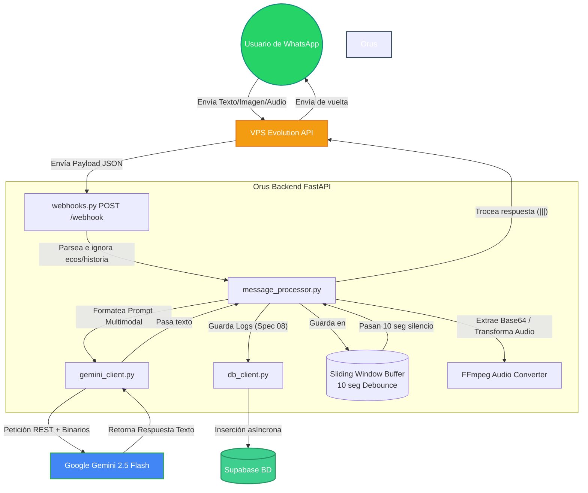

# Mapa de Arquitectura del Sistema Orus

Este documento presenta gráficamente el flujo de datos y la topología del backend.

## Flujo de Mensajería y Pipeline Multimodal

### Componentes Clave
1. **Sliding Window Buffer:** Permite la agregación de múltiples mensajes (texto, imágenes, audios) enviados en una "ráfaga" por el usuario en una única intención para Gemini.
2. **FFmpeg Converter:** Evita errores de compatibilidad convirtiendo nativamente el `audio/ogg; codecs=opus` de WhatsApp Web a `audio/mp3`.
3. **Mapeo Explícito Multimodal:** En `gemini_client.py`, los binarios están aislados con etiquetas `[--- INICIO DEL ARCHIVO X ---]` para evitar que Gemini mezcle contexto entre texto y audio.
