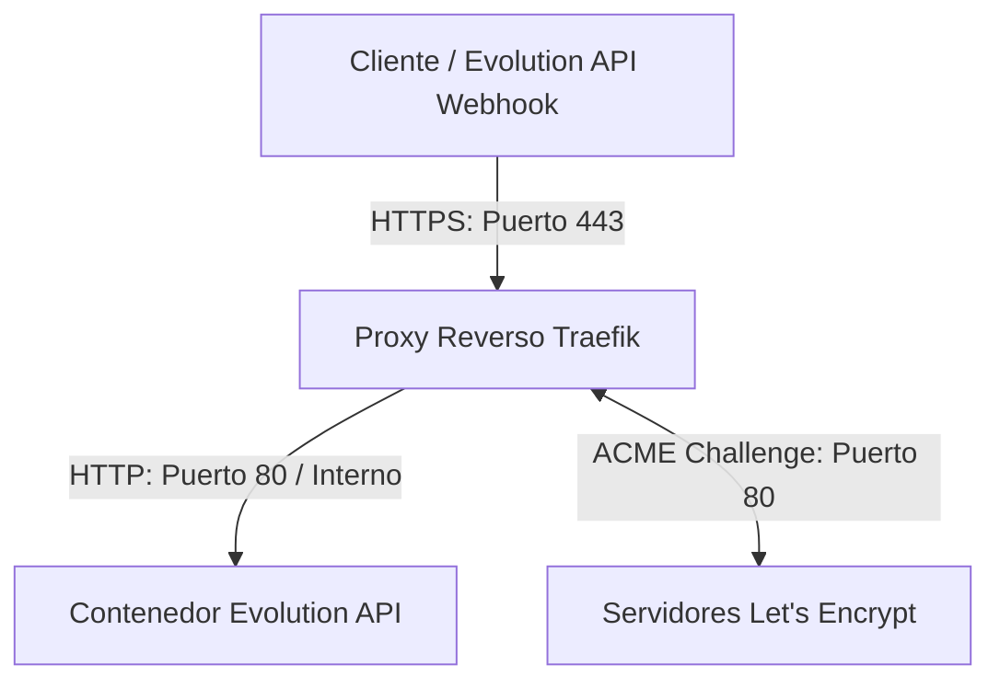

# Spec 13: Mitigación de Certificados SSL (Traefik / Let's Encrypt) en Easypanel

## 1. Objetivo
Diagnosticar y resolver el fallo en la capa de transporte (HTTPS / Puerto 443) sobre el subdominio `whatsapp.orusquiroterapia.online`, permitiendo que el proxy reverso global de Easypanel (Traefik) entregue un certificado SSL/TLS válido emitido por Let's Encrypt (o CA alternativa) para habilitar el pipeline de agendamiento conversacional en producción.

---

## 2. Arquitectura de Red y Flujo de Certificación

El flujo de red para la resolución segura del webhook se estructura bajo los siguientes niveles:

### El Mecanismo de Fallo
1. Traefik intenta resolver la validación **HTTP-01** de Let's Encrypt mediante el subdominio expuesto.
2. Si Let's Encrypt no logra establecer conexión con el puerto 80 del host (o si las peticiones previas fallaron y el dominio está bajo bloqueo por límite de tasa / Rate Limit), el archivo de almacenamiento de certificados (`acme.json`) no se actualiza.
3. Al fallar la emisión del certificado, Traefik rechaza la negociación SSL de transporte en el puerto 443 (devolviendo `SEC_E_INTERNAL_ERROR` o "No se puede crear un canal seguro").

---

## 3. Plan de Diagnóstico y Mitigación Propuesto

Para mitigar el fallo de manera asistida y manual en el host, se estructuran las siguientes cuatro fases de análisis descriptivo:

### Fase I: Auditoría de Logs de Traefik (Aislamiento de la Causa Raíz)
- **Procedimiento:** Acceder al panel de administración de Easypanel y navegar a la sección de configuración de Traefik (`Settings > General > Traefik > Logs`).
- **Análisis Esperado:** Filtrar o buscar términos clave en el log (`acme`, `error`, `letsencrypt`, `rate limit`, `challenge`) para identificar el motivo exacto del rechazo por parte de Let's Encrypt.

### Fase II: Validación de Configuración General de Traefik en Easypanel
- **Procedimiento:** Verificar la existencia de un correo de contacto válido para Let's Encrypt en la pestaña de configuración del proxy reverso.
- **Validación del Resolver:** Comprobar si el resolvedor de Let's Encrypt (normalmente llamado `letsencrypt` o similar) está seleccionado correctamente en la pestaña de dominios de la aplicación `Evolution API` en Easypanel.

### Fase III: Saneamiento del Almacenamiento ACME (`acme.json`)
- **Procedimiento:** Si los logs apuntan a una corrupción del archivo o bloqueos de escritura:
  - Se puede realizar una copia de respaldo del archivo de certificados en el servidor host.
  - Se procede a vaciar el archivo a un estado base (estructura JSON vacía `{}`) o eliminarlo temporalmente para que Traefik lo regenere.
  - Asegurar que los permisos del archivo cumplan con los estándares de seguridad exigidos por Traefik (acceso de lectura/escritura exclusivo del propietario, permisos `600`).
  - Reiniciar el contenedor de Traefik desde el panel de Easypanel para forzar la recreación y la nueva solicitud de emisión.

### Fase IV: Mitigación de Rate Limit
- **Procedimiento:** Si el log de Traefik confirma que se ha alcanzado el límite de tasa de Let's Encrypt:
  - **Opción de Pruebas:** Modificar la URL del endpoint ACME de producción a la URL de pruebas (Staging) en las variables de entorno de Traefik para depurar la conectividad sin agotar la cuota de certificados.
  - **Opción de Servidor Alternativo:** Si Easypanel lo permite, configurar un resolvedor de certificados alternativo basado en ZeroSSL.

---

## 4. Impacto en el Código Existente
- **Cero Impacto:** Este procedimiento es exclusivo del entorno de despliegue y administración de red en el host VPS. No se modificará el código fuente del backend local de FastAPI (`main.py`) ni los scripts de registro local (`register_webhook.py`).
- **Actualización de Entorno:** Una vez resuelto el SSL en el host, se actualizará el archivo `.env` del entorno local con el esquema HTTPS correspondiente para validar el flujo completo.
