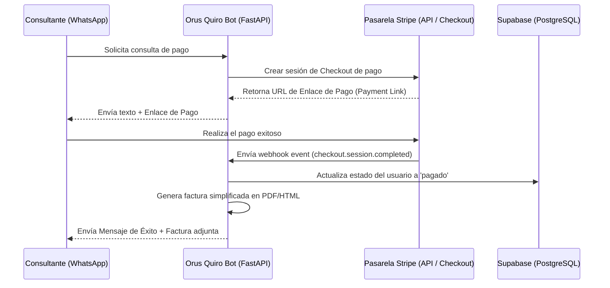

# Spec 15: Pasarela de Pago Stripe, Webhooks de Confirmación y Facturación Asíncrona

## 1. Objetivo
Integrar la pasarela de pagos internacional **Stripe** como la solución única y exclusiva de pagos del sistema. Esto automatizará la validación de transacciones internacionales y nacionales en múltiples divisas (exhibiendo precios locales y cobrando de forma nativa), generará facturas fiscales simplificadas en PDF enviadas de forma asíncrona por WhatsApp y actualizará el estado del consultante en Supabase. Se descarta Mercado Pago debido a complejidades en la conversión cambial y altos índices de rechazo en tarjetas extranjeras para cuentas brasileñas.

---

## 2. Arquitectura de Integración y Flujo de Pago

---

## 3. Decisiones Técnicas y Selección de Pasarela

### A. ¿Por qué Stripe y la Exclusión de Mercado Pago?
1. **Cobro Internacional Multidivisa Nativo:** Permite definir precios y procesar cobros en la divisa del cliente (USD, EUR, MXN, COP, etc.). El cliente tiene un checkout localizado en español, lo que eleva drásticamente la tasa de conversión en comparación con Mercado Pago, el cual forzaría cobros en Reales Brasileños (BRL) con alta fricción.
2. **Conversión y Depósito Automático a BRL:** Stripe gestiona la conversión de divisas extranjeras a Reales Brasileños de forma transparente y realiza depósitos automáticos en la cuenta bancaria de Brasil, eliminando burocracia cambiaria manual.
3. **Aprobación Global y Antifraude (Stripe Radar):** Minimiza falsos rechazos en tarjetas emitidas en el extranjero, a diferencia de los filtros locales de Mercado Pago Brasil, que tienden a bloquear cobros internacionales de forma preventiva.
4. **Webhooks Seguros:** La verificación de firma criptográfica mediante `stripe-signature` garantiza que las notificaciones de éxito de pago sean inmunes a la suplantación.

### B. Módulo de Facturación
- Al completarse la sesión de cobro exitosa en Stripe, el backend interceptará los metadatos de la compra (número de teléfono JID de WhatsApp del usuario).
- Se creará un servicio en `api/services/billing.py` para renderizar la factura simplificada en PDF y despacharla como documento adjunto por WhatsApp.

---

## 4. Plan de Implementación (Tareas)

- **[ ] Task 1. Creación del Router de Pagos (`payments.py`):** Desarrollar `api/routes/payments.py` con el endpoint de escucha de webhooks de la pasarela y la verificación de firma criptográfica.
- **[ ] Task 2. Servicio de Integración de Pasarela:** Desarrollar `api/services/payment_gateway.py` para interactuar con el SDK de la pasarela y generar los enlaces de pago dinámicos adjuntando los metadatos del usuario.
- **[ ] Task 3. Generación de Factura:** Implementar un servicio de renderizado de factura en PDF/HTML con los datos de la transacción en la subcarpeta `api/services/billing.py`.
- **[ ] Task 4. Configuración de Alertas de Pago:** Desarrollar notificaciones automáticas inmediatas (hacia el canal de auditoría en Telegram y actualización del estado del usuario en la tabla `orus_users` de Supabase).
- **[ ] Task 5. Adaptación Conversacional en Gemini:** Entrenar a Gemini para guiar al usuario que decide hacer la consulta proporcionándole el enlace de pago seguro generado al vuelo.
