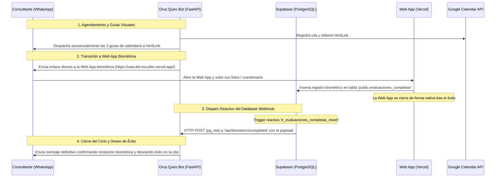

# Spec 16: Web App de Datos del Consultante, Flujo de Agendamiento y Guía de Calendario

## 1. Objetivo
Integrar la Web App preexistente y 100% funcional para la recolección de datos biométricos del consultante de manera **posterior e inmediata a la confirmación exitosa de su agendamiento interactivo (Spec 13)**. El bot Orus enviará el enlace seguro de recolección biométrica al final del protocolo de guías de Google Calendar. Una vez que el consultante complete la carga de fotos y cuestionarios en la Web App, el sistema guardará los datos en Supabase, lo que de forma reactiva disparará una confirmación automática por WhatsApp que cerrará formalmente el ciclo y le deseará éxito hasta el día de su cita.

## 1.1. URL de Producción de la Web App
- **URL:** `https://ruta-del-escultor.vercel.app/`
- **Plataforma de despliegue:** Vercel
- **Trigger de envío:** Inmediatamente después del envío exitoso de las guías visuales de Google Calendar y el enlace `htmlLink` de la cita.
- **Nota:** El audio explicativo de 3 minutos (Spec 14) ya prepara al consultante cognitivamente para este paso, minimizando la fricción y asegurando un alto índice de compleción.

---

## 2. Arquitectura del Flujo de Recolección de Datos y Cierre Reactivo



---

## 3. Integración Técnica Implementada

### A. Despacho del Link de la Web App en `calendar_client.py`
- Al final de la rutina asíncrona `send_visual_agenda_protocol()`, tras enviar las 3 imágenes guías y la invitación de Google Calendar, el bot aguarda un delay asíncrono de **3.0 segundos**.
- Envía el mensaje formal de redirección biométrica:
  > *"Para completar tu proceso, el siguiente paso es registrar tus datos biométricos en nuestro formulario seguro. Encontrarás ahí las instrucciones que ya te explicamos en el audio: https://ruta-del-escultor.vercel.app/"*

### B. Trigger y Función Reactiva en Supabase (`pg_net`)
Para garantizar un desacoplamiento absoluto y una reacción inmediata, se habilitó la extensión `pg_net` en la base de datos de Supabase y se configuró un trigger nativo:
- **Extensión:** `CREATE EXTENSION IF NOT EXISTS pg_net;`
- **Función PostgreSQL (`public.handle_evaluacion_completa`)**:
  ```sql
  CREATE OR REPLACE FUNCTION public.handle_evaluacion_completa()
   RETURNS trigger
   LANGUAGE plpgsql
   SECURITY DEFINER
  AS $function$
  declare
    payload jsonb;
    request_id bigint;
  begin
    payload := jsonb_build_object(
      'wa_id', NEW.wa_id,
      'nombre', NEW.nombre,
      'fotos_completadas', true
    );
    
    select net.http_post(
      url := 'https://annually-murmuring-reuse.ngrok-free.dev/api/biometrics/completed',
      body := payload::text,
      headers := '{"Content-Type": "application/json"}'::jsonb
    ) into request_id;
    
    return NEW;
  end;
  $function$
  ```
- **Trigger:**
  ```sql
  CREATE TRIGGER tr_evaluaciones_completas_insert
  AFTER INSERT ON public.evaluaciones_completas
  FOR EACH ROW
  EXECUTE FUNCTION handle_evaluacion_completa();
  ```

### C. Endpoint del Webhook de Biométricos (`api/routes/webhooks.py`)
FastAPI expone un endpoint seguro que recibe la notificación de inserción desde Supabase:
- **Ruta:** `/api/biometrics/completed`
- **Lógica de Negocio:**
  - Extrae el número de teléfono del consultante (`wa_id`) y su nombre.
  - Limpia y formatea el número para garantizar compatibilidad con Evolution API (añadiendo el sufijo `@s.whatsapp.net`).
  - Despacha inmediatamente el mensaje definitivo de confirmación por WhatsApp:
    > *"¡Hola [Nombre]! Te confirmo que tus fotos y datos biométricos se han registrado correctamente en nuestro sistema seguro. Con esto cerramos con total éxito el ciclo de configuración de tu cita. ¡Te deseo el mayor de los éxitos en tu Auditoría Biosemiótica! Que tengas un excelente día."*

---

## 4. Estado de Verificación y Pruebas
- **Prueba Unitaria de Integración:** Ejecutada exitosamente mediante el script de prueba `scratch/test_biometrics_webhook.py` simulando la llamada del webhook de Supabase.
- **Respuesta del Servidor:** **HTTP 200 OK** con respuesta de Evolution API procesada correctamente.
- **Servidor Activo:** Uvicorn en ejecución sobre el puerto `8000` con recarga automática activa (`--reload`) vigilando cambios en tiempo real.
guías de calendario, finalizando con un mensaje empático deseándole éxito en la entrevista.
