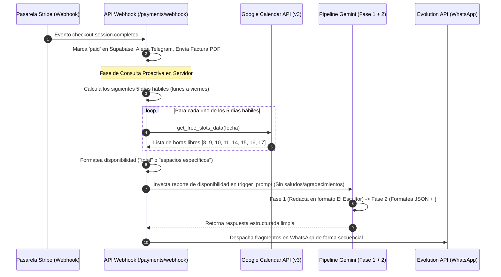

# Spec 17: Flujo de Agendamiento Proactivo Post-Pago y Blindaje del Formateador

## 1. Objetivo
Establecer la transición asíncrona, robusta y biosemiótica entre el webhook de Stripe confirmando el cobro y la presentación inmediata del menú de agendamiento en WhatsApp. Para maximizar la fiabilidad y mitigar la latencia, el servidor calculará y consultará la disponibilidad del calendario en el backend y la inyectará de forma estructurada en el prompt de Gemini. Esto remueve la dependencia del llamado cognitivo autónomo a herramientas, blindando al formateador contra strings vacíos y garantizando que el usuario reciba sus horarios sin rodeos redundantes de por medio.

---

## 2. Arquitectura de Transición y Flujo Lógico

---

## 3. Especificaciones de Negocio y Reglas Clínicas

1. **Rango Temporal Ampliado**: La consulta debe abarcar estrictamente los **5 días hábiles** consecutivos (lunes a viernes) a partir del día siguiente al de la transacción (omitiendo sábados y domingos de la búsqueda).
2. **Ventana Quirúrgica de Atención**: El horario de consulta operará en dos bloques:
   - Mañana: **08:00 AM - 12:00 PM** (Horas de inicio: `8, 9, 10, 11`)
   - Tarde: **02:00 PM - 06:00 PM** (Horas de inicio: `14, 15, 16, 17`)
3. **Tono Clínico de Disponibilidad**:
   - **Día Libre**: *"Cuento con total disponibilidad para el día [Día X]"*.
   - **Día Reservado parcialmente**: *"Para el día [Día X] cuento con los siguientes espacios disponibles: [Lista de horas]"*.
4. **Tránsito Inmediato y Silencioso**: La respuesta de agendamiento debe presentarse **inmediatamente después de la factura PDF**, sin textos de agradecimiento de por medio ("gracias por tu pago", "ya recibí tu dinero"), puesto que el pie de factura (caption) ya notifica la transición a la agenda.

---

## 4. Desglose de Tareas Atómicas (Tasks)

### [ ] Task 1: Ampliación de Horarios y Retorno Limpio de Datos en `calendar_client.py`
- Modificar la constante `BUSINESS_HOURS` en `api/services/calendar_client.py` para incluir la hora de inicio de las 8:00 AM: `[8, 9, 10, 11, 14, 15, 16, 17]`.
- Desarrollar la función `get_free_slots_data(date_str: str) -> list[int]` que consulte el Google Calendar de forma aislada y retorne directamente una lista con los enteros de las horas libres del día comercial, previniendo el formateo textual del backend.

### [ ] Task 2: Cálculo Dinámico de 5 Días Hábiles en `payments.py`
- Desarrollar en `api/routes/payments.py` una función de utilidad `get_next_5_business_days()` para calcular de manera dinámica las fechas en formato `YYYY-MM-DD` de los siguientes 5 días que pertenezcan a la semana laboral de lunes a viernes (excluyendo sábados y domingos).

### [ ] Task 3: Obtención y Formateo de Disponibilidad en el Servidor
- En el pipeline del webhook exitoso de `payments.py`, invocar `get_free_slots_data` para los 5 días hábiles obtenidos.
- Comparar los resultados con `BUSINESS_HOURS` para construir de forma automática el informe textual de disponibilidad (si es igual a `BUSINESS_HOURS` reportar disponibilidad total; en caso contrario, listar los bloques individuales disponibles).

### [ ] Task 4: Modificación de Directivas y Prompt en Gemini
- Rediseñar el `trigger_prompt` que se envía a `generate_response()` para inyectar este informe directo.
- Establecer en el prompt directivas estrictas e irrevocables para Gemini que le prohíban mencionar o agradecer por el cobro/factura, ordenándole desplegar directamente los días hábiles y las opciones de horarios de forma limpia e impersonal (formato clínico "El Escultor").

### [ ] Task 5: Blindaje Antierosivo en `gemini_client.py`
- Modificar el pipeline del formateador en `api/services/gemini_client.py` (Fase 2). Si la respuesta en texto libre del modelo llega vacía o nula en la primera fase, interceptar preventivamente la ejecución antes de lanzar la llamada de formateo e inyectar un JSON clínico de fallback con la información estructurada de respaldo.

### [ ] Task 6: Suite de Pruebas E2E y Registro de Auditoría
- Ejecutar simulaciones locales del webhook de Stripe.
- Validar mediante el archivo log que la factura se envía, los 5 días hábiles se calculan con precisión milimétrica, Gemini genera su JSON de agendamiento y los mensajes se fragmentan en WhatsApp correctamente sin rastro de textos introductorios del pago.
- Registrar todas las acciones y decisiones arquitectónicas en `bitacoras/backend_log.md` y `bitacoras/agents_log.md`.
