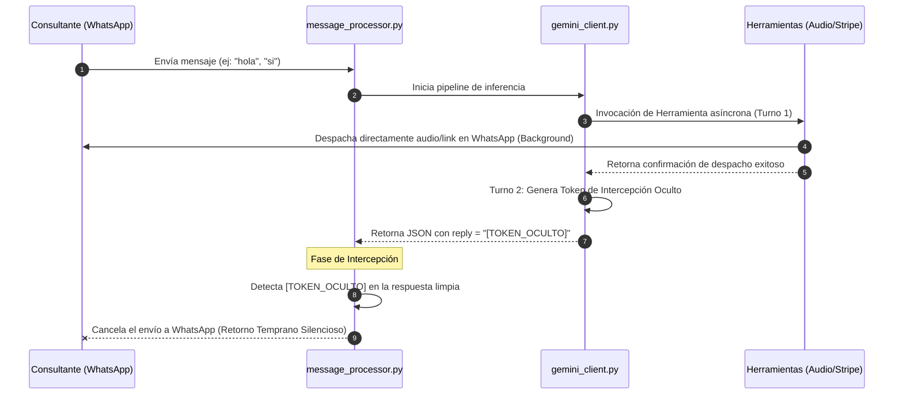

# Spec 23 — Homologación de Flujo Conversacional, Blindaje Antierosivo de Formateo e Intercepción Silenciosa

## 1. Objetivo
Blindar el pipeline conversacional de Orus contra fallos de formato del modelo de lenguaje (respuestas vacías en el segundo turno de inferencia tras la ejecución de herramientas asíncronas) y erradicar la duplicación de mensajes en WhatsApp. Para ello, se homologará el patrón de **Intercepción Silenciosa** (implementado exitosamente en el Spec 22 con `[AGENDA_COMPLETA]`) a los flujos de **Despacho de Audio (Fase 2)** y **Cierre de Pago (Fase 3)**, y se dotará al backend de un robusto blindaje antierosivo para capturar strings vacíos.

---

## 2. Diagnóstico y Problema de Continuidad
* **El Quiebre:** Cuando Gemini procesa una intención que requiere disparar una herramienta asíncrona (como `send_introductory_audio` o `generate_payment_link`), la herramienta en sí misma ya despacha de manera nativa y directa el contenido a WhatsApp en segundo plano.
* **El Conflicto:** En el siguiente turno del bucle interno, Gemini recibe la confirmación de la herramienta. Al no tener semánticamente más información que añadir (porque la herramienta ya lo cubrió todo), el modelo devuelve una respuesta vacía (`Raw: `).
* **El Fallo:** Como `api/services/gemini_client.py` carece de un blindaje de formato nativo y robusto contra strings vacíos, el parser de JSON se quiebra (`Expecting value: line 1 column 1`). Esto activa la excepción de emergencia, despachando al cliente un confuso mensaje de error (*"Lo siento, tuve un error interno..."*) y activando de forma incorrecta `requires_human = True`.
* **Caídas de Contexto:** Las constantes desconexiones y caídas de sesión debido a la actualización de Antigravity 2.0 provocan interrupciones en la ejecución, por lo que este spec actúa como un plano de blindaje inmutable que cualquier agente puede leer y continuar instantáneamente.

---

## 3. Arquitectura del Flujo Homologado (Intercepción Silenciosa)



---

## 4. Desglose de Tareas Atómicas (Tasks)

### Task 23.1 — Blindaje Antierosivo y Captura de Respuestas Vacías en `gemini_client.py`
* **Acción:** Robustecer el bloque `try/except` de parseo JSON en `api/services/gemini_client.py` (líneas 240-259).
* **Especificación:** Si `raw_text` está completamente vacío, nulo o contiene únicamente espacios, y el historial reciente indica que se acaba de ejecutar una herramienta exitosamente en el ciclo de ejecución actual, interceptar preventivamente la excepción y retornar de forma segura un JSON estructurado de fallback con un token de intercepción correspondiente al tool llamado, previniendo el envío del mensaje de error genérico.
* **Pseudocódigo de Referencia:**
  ```python
  # // CONCEPTO
  # if not raw_text.strip() and tool_executed_successfully:
  #     return {
  #         "reply": "[SILENT_FALLBACK] [##EOS##]",
  #         "sentiment": "Neutral",
  #         "requires_human": False
  #     }
  ```

### Task 23.2 — Homologación del Despacho de Audio (Fase 2)
* **Acción:** Integrar el token de intercepción silenciosa `[AUDIO_ENVIADO]` para la herramienta `send_introductory_audio`.
* **System Prompt:** Instruir a Gemini en `system_rules` de `gemini_client.py` para que, inmediatamente después de invocar `send_introductory_audio` con éxito, su campo `reply` devuelva única y exactamente `[AUDIO_ENVIADO]`.
* **Backend:** En `api/services/message_processor.py`, en el fragmentador de salida (alrededor de la línea 307), agregar la intercepción silenciosa: si `reply_clean` contiene `[AUDIO_ENVIADO]`, retornar tempranamente sin despachar ningún texto redundante a WhatsApp.

### Task 23.3 — Homologación de Generación de Cobros (Fase 3B)
* **Acción:** Integrar el token de intercepción silenciosa `[COBRO_ENVIADO]` para la herramienta `generate_payment_link`.
* **System Prompt:** Instruir a Gemini en `system_rules` de `gemini_client.py` para que, inmediatamente después de invocar `generate_payment_link` con éxito, su campo `reply` devuelva única y exactamente `[COBRO_ENVIADO]`.
* **Backend:** En `api/services/message_processor.py`, en el fragmentador de salida, añadir la intercepción silenciosa para `[COBRO_ENVIADO]` con retorno temprano silencioso idéntico.

### Task 23.4 — Suite de Pruebas de Resiliencia e Integración
* **Acción:** Simular localmente los inputs conversacionales en el webhook de FastAPI.
* **Prueba 1:** Simular el mensaje `"si"` que activa la Fase 2 y validar que se envíe el audio y que el bot NO envíe ningún mensaje de error ni texto duplicado (retorno temprano silencioso exitoso).
* **Prueba 2:** Simular la intención explícita de compra que activa la Fase 3B y verificar que se genere el link y se intercepte silenciosamente la respuesta de Gemini.
* **Prueba 3:** Forzar de forma artificial una respuesta vacía del LLM para validar el blindaje antierosivo de fallback de la Task 23.1.
